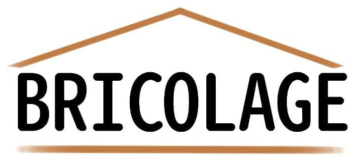

<h1 > 👩🏽Olá eu sou a Thalita e esse é um projeto bricolage de um site que estou desenvolvendo em equipe.
   
💻Atualmente estou estudando na area de Desenvolvimento de sistemas, aprendendo e aprimorando meus conhecimentos .</h1>

 
  
  
  
 
  

 
 

<h2>Projeto Bricolage</h2>
 
<!DOCTYPE html>
<html>
<head>
<meta name="viewport" content="width=device-width, initial-scale=1.0">

</head>
<body>

  

  

    <ul>
      <li>Menu</li>
      <li>Vídeos</li>
      <li>Shopping</li>
      <li>Contato</li>
    </ul>
  

  

    <h1>Quem Somos!</h1>
    
Você precisa entender como funcionam as técnicas 
  de instalações domiciliar e seus processos. 
  A Bricolage foi criada com o intuito de melhor
  atender as dúvidas, e de como e com quais ferramentas
  é necessario para realizar manutencões domiciliares,
  por exemplo como trocar uma simples lãmpada em sua 
  casa sem um profissional credenciado e sem risco 
  de acidente.
  Aqui iremos te ensianar passo a passo com quais 
  materias ou ferramentas, e como isso poderá ser 
  realizado por você.

  

  

    

      <h2>What?</h2>
      
não definido.

      <h2>não definido?</h2>
     
  

  
Realização de suas Ídéias.

</body>
</html>

